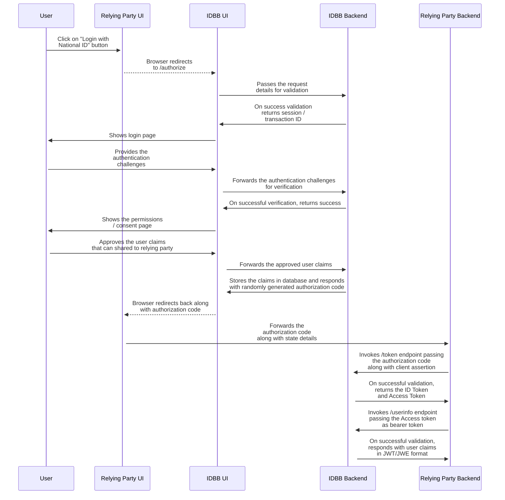

# 9 Internal Workflows

If GovStack will offer global workflow management for cross-building block use cases, Identity and Verification Building Block will have its internal workflows for its own internal business flows execution.

Non-exhaustive list of examples:

* For onboarding a new individual.
* For managing identity changes after an event on a person's identity (name change, death, etc.).
* For life cycle management of an individual's identity evidence (i.e. ID Cards).
* For management of access rights to services on an individual's data.

Those workflows will be described in a later version.

### 9.1 Identity Verification Workflow

The below workflow details the steps involved in the relying party application enabling the end user to log in using their National ID. Once the login process is completed, Identity Building Block also allows the relying party to get verified user claims based on explicit permission from the end user.

The steps are:

* The relying party wants to authenticate the user to the Identity Building Block.
* The relying party redirects the user to the Identity Building Block UI.
* The user will authenticate on the Identity Build block.
* The Identity Build Block will ask the user permission to share his/her personal data.
* The User selected the attributes he/she accepts to share.
* A code is generated and returned by the Identity Building Block to the relying party.
* The relying party uses the code and receives an ID token and an access token.
* The relying party then uses the access token to receive the user information.
* The user can pursue its application within the relying party UI.

