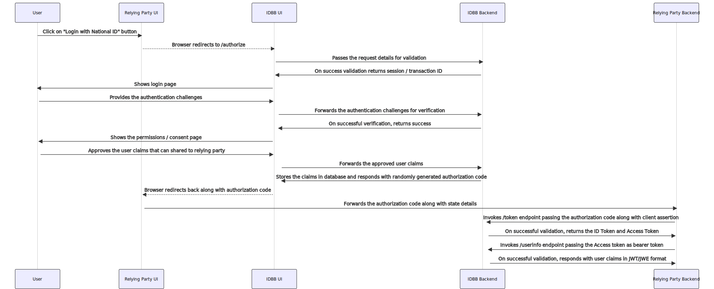

# 9 Internal Workflows

If GovStack will offer global workflow management for cross-building block use cases, Identity and Verification Building Block will have its internal workflows for its own internal business flows execution.

Non-exhaustive list of examples:

* For onboarding a new individual.
* For managing identity changes after an event on a person's identity (name change, death, etc.).
* For life cycle management of an individual's identity evidence (i.e. ID Cards).
* For management of access rights to services on an individual's data.

Those workflows will be described in a later version, but some of them are already available as flow diagrams in this document ([Use Cases](6-functional-requirements.md#docs-internal-guid-dcbda535-7fff-1e71-07b5-815d5f9c5e1d)).

### Identity Verification Workflow

The below workflow details the steps involved in relying party application enabling the end user to login using their National ID. Once the login process is completed, IDBB also allows the relying party to get verified user claims based on explict permission from the end user.

<figure><figcaption></figcaption></figure>
